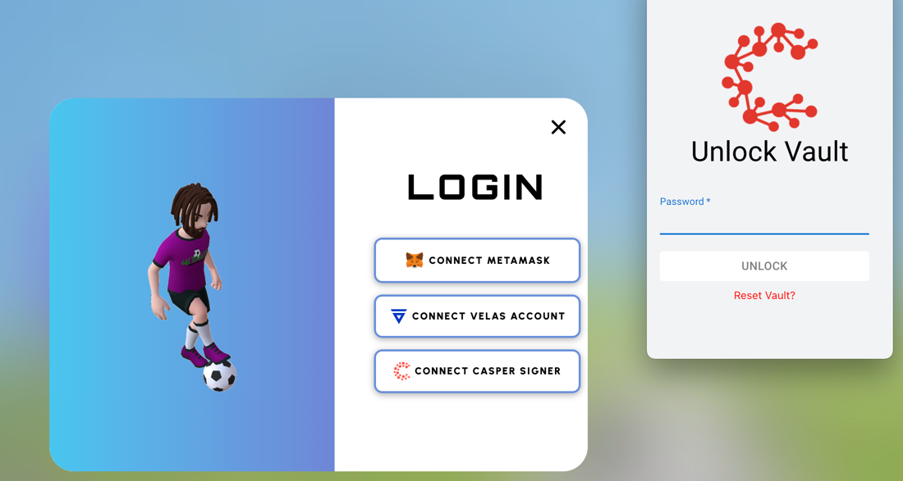
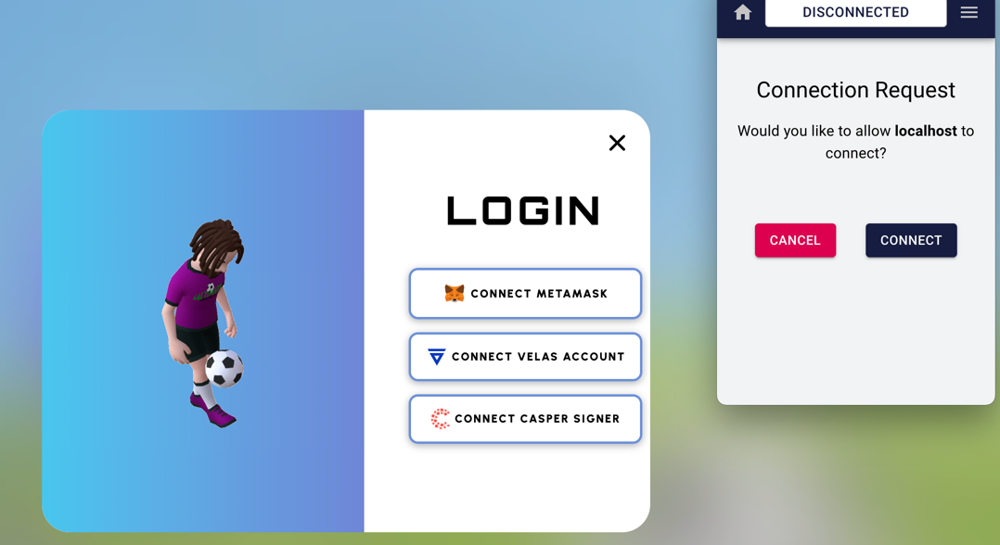
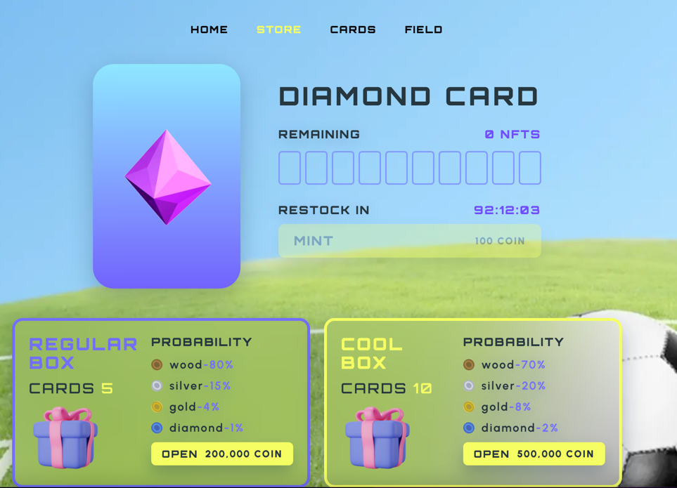
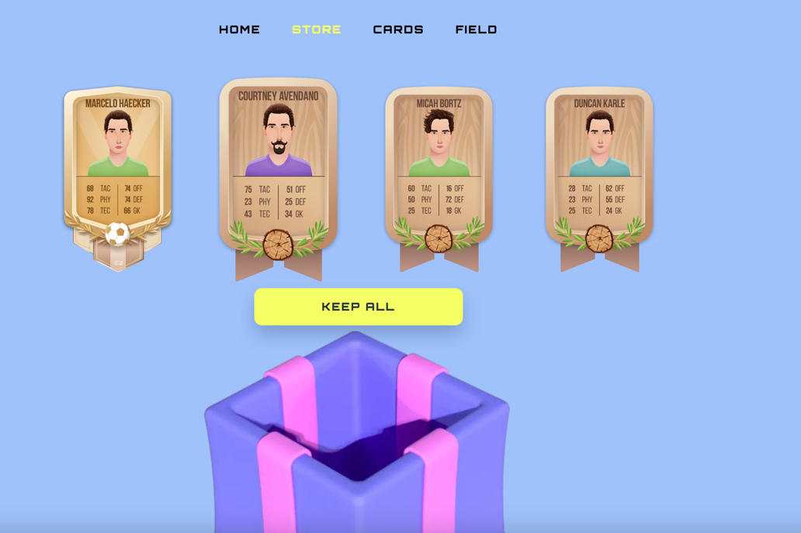
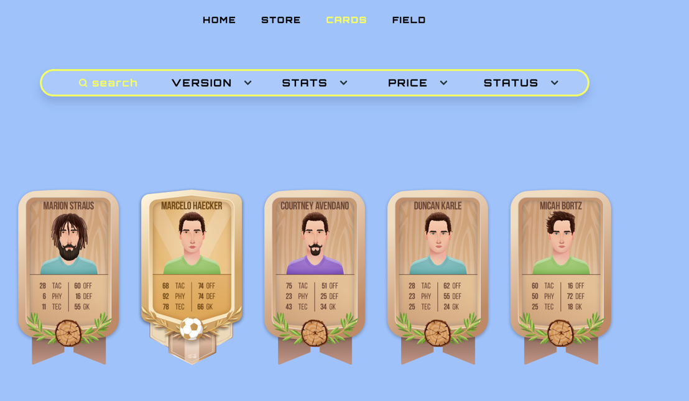
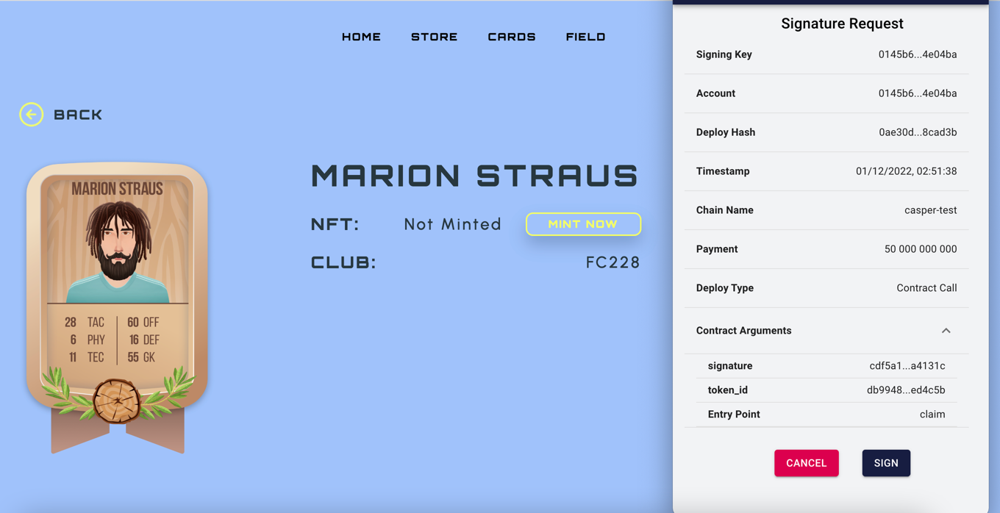
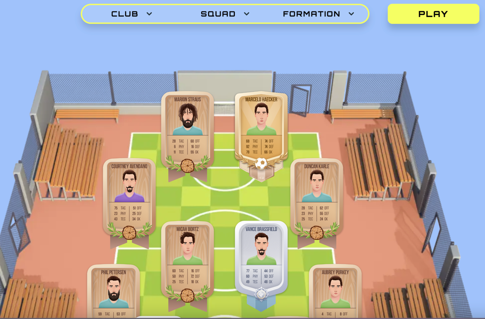
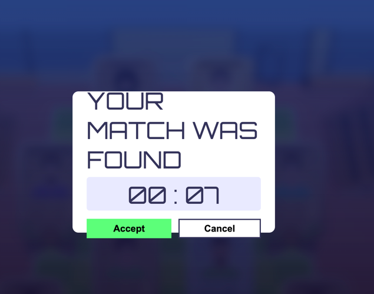
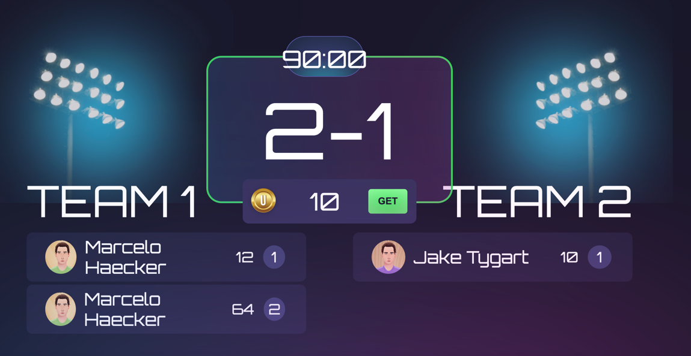

## How to run?

**Installing.**

Golang is our backend language.

We are using version 1.17.4. You can download it from the official website [GoLang](https://go.dev/dl/), and install it according to the official [instructions](https://go.dev/doc/install.)

**Database.**

For our project we use a relational database PostgreSQL, version 12.11 which you can download by following the link from the official [website](https://www.postgresql.org/download/) or you can run your database in a Docker container.

**Docker.**

For isolated installation of databases and servers we need a Docker, version 20.10.16 or higher, you can download it at official [website](https://docs.docker.com/engine/install/)

```
docker run --name=db -e POSTGRES_PASSWORD=‘$YOUR_PASSWORD’ -p $YOUR_PORTS -d --rm postgres

docker exec -it db createdb -U postgres ultimatedivision_test
```

## Config

The application depends on config values that are located in the config file. (examples of configs are in the folder - configsexamples)

```
go run cmd/ultimatedivision/main.go setup
go run cmd/currencysigrer/main.go setup
go run cmd/nftsigrer/main.go setup
```

**Run the main server.**

From the web/console directory at the root of the project use this commands to build front end part of project:
```
npm i --force && npm run build
```

You can run it with the command in root of the project:
```
go run cmd/ultimatedivision/main.go run
```
After this you can open console on localhost:8088 and admin panel on localhost:8087


**Mini servers.**

In general, we use private mini-servers when we work with signing something with a private key to protect personal data from hackers.
List of these servers:
- Currency signer;
- NFT signer;

Brief information about them:
- we don't have any api in those servers;
- we have docker files/docker-compose files where these servers are already started as closed;
- we have private keys in config files, each server has its own file;
- each server has an endless cycle with an interval of work and performs its specific logic;

You will find commands for local startup under the server description.
Deployment instructions on the remote server according to the docker files in the `deploy` directory.

**Currency signer**

The currency signer runs a infinite cycle with an interval of operation that monitors the records of currency waitlist in which there is no signature and if it finds them then generates a signature and sends a transaction to transfer money.
```
go run cmd/currencysigrer/main.go run
```

**NFT signer**

The nft signer runs an infinite cycle with an interval of operation that monitors the records of waitlist in which there is no signature and if it finds them then generates a signature and sends a transaction to mint nft.
```
go run cmd/nftsigrer/main.go run
```

**Recommendation **
Access to the server shouldn't be direct. We recommend organizing access to the server through VPN + SSH key.

## Tests

To run all tests for the entire project, use the command:
```
go test ./...
```

To run the go-linter use the command:
```
golangci-lint run
```

## Deployment architecture

**Solution**.

To make deployment independent of cloud providers, use containerization through docker images. That could be runnable on any server, as result we could switch between providers whenever we want without changing the deployment process.

**File locations.**

All docker files should locate in **${projectname}/deploy** directory.
For each service, at the project, write a separate docker file.

**Naming.**

According to docker files naming convention, it should have name of service before dot (ex.: signer.Dockerfile, projectname.Dockerfile).

If the project has several docker-compose files, these files should also have naming according to docker files naming convention (docker-compose.test.yml, docker-compose.local.yml).

**Deployment.**

For deployment use GitHub actions that trigger commands from Makefile. It will build docker images (with commit hash and latest), and it will be pushed to our docker registry. Images from docker registry will use on deployment server in docker-compose file.

**Rollback to particular version.**

On deployment part,  create docker image with name that contains commit hash (docker-registry-address/service-name:commit-hash), as result we could rollback to particular version whenever we want.

**Access to logs.**

For access to logs, we use [Dozzle](https://dozzle.dev/).
It's running as a separate service in docker-compose. To create login & password - pass as environment variables to docker-compose and provide credentials to QA and Devs. So that they have easy and fast access to logs.`

**Metrics & graphs.**

To collect standards (like CPU, Memory usage) or custom metrics we use [Prometheus](https://prometheus.io/docs/introduction/overview/).

To make graphs we use [Grafana](https://grafana.com/docs/grafana/latest/introduction/) which uses metrics passed by Prometheus.


**Metric examples.**
>metrics/metrics.go
```
type Metric struct {
   handler  http.Handler
   newUsers Counter
}
   
// NewUsersInc increment Counter newUsers.
func (metric *Metric) NewUsersInc() {
   metric.newUsers.Inc()
}

// NewMetric is a constructor for a Metric.
func NewMetric() *Metric {
    newUsers := prometheus.NewCounter(prometheus.CounterOpts{
        Name: "number_registrations",
        Help: "The total number of successful registrations.",
    })
    
    // Create a custom registry.
   registry := prometheus.NewRegistry()

   // Register using our custom registry gauge.
   registry.MustRegister(newUsers)
   return &Metric{
        // Expose metrics.
        handler:  promhttp.HandlerFor(registry, promhttp.HandlerOpts{Registry: registry}),
        newUsers: newUsers, 
    }
}
```
>console/consoleserver/controllers/auth.go
```
// Register creates a new user account.
func (auth *Auth) Register(w http.ResponseWriter, r *http.Request) {
	w.Header().Set("Content-Type", "application/json")
	ctx := r.Context()

	var err error
	var request users.CreateUserFields

	if err = json.NewDecoder(r.Body).Decode(&request); err != nil {
		auth.serveError(w, http.StatusBadRequest, AuthError.Wrap(err))
		return
	}

	if !request.IsValid() {
		auth.serveError(w, http.StatusBadRequest, AuthError.New("did not fill in all the fields"))
		return
	}

	err = auth.userAuth.Register(ctx, request.Email, request.Password, request.NickName, request.FirstName, request.LastName, request.Wallet)
	if err != nil {
		switch {
		case userauth.ErrAddressAlreadyInUse.Has(err):
			auth.serveError(w, http.StatusBadRequest, userauth.ErrAddressAlreadyInUse.Wrap(err))
			return
		default:
			auth.log.Error("Unable to register new user", AuthError.Wrap(err))
			auth.serveError(w, http.StatusInternalServerError, AuthError.Wrap(err))
			return
		}
	}
	
	auth.metric.LoginsInc()
}
```

# web/console

## Initial web setup
1. Install node. Current node version: [v14.18.1](https://nodejs.org/ja/blog/release/v14.18.1/).
2. Install npm. Current npm version: [6.14.15](https://www.npmjs.com/package/npm/v/6.14.5).
3. Run command `npm ci`. Uses to get and install dependencies only depend on [package-lock.json](./web/console/package-lock.json).

## Commands:
1. `npm run lint` - runs eslint checks with [.eslintrc config](./web/console/.eslintrc).
2. `npm run start` - runs app without server on [localhost](http://localhost:3000).
3. `npm run build` - runs app with webpack.config.json on 'production' mode on [localhost](http://localhost:8088).
   Builds the app for production to the `dist` folder.
   It correctly bundles React in production mode and optimizes the build for the best performance.
   Also, automatically runs style lint rules with [.stylelintrc config](./web/console/.stylelintrc).
4. `npm run dev` - runs app with [webpack.config.js](./web/console/webpack.config.js) on 'development' mode.
   Builds the app for development to the `dist` folder.
   Faster that build but much larger size.
   Also contains 'watch' development mode. Automaticaly rebuilds app when code is changed.
   Runs on [localhost](http://localhost:8088).
5. `npm run test` - runs coverage code tests with [jestSetup.ts](./web/console/jestSetup.ts) config.

## Structure
1. __cards, clubs, divisions, gameplay, marketplace, seasons, users__ - domain entities.\
   Each folder contains domain entities and services.\
   Each entity service serves and calls _API http/ws_ requests.
2. __api__: holds entities _API http/ws_ clients.\
   APIClient is base client that holds http/ws client and errors handler.
3. __private__: _http_ client implementation (Custom wrapper around fetch _API_).\
   Holds _DELETE_, _GET_, _PATCH_, _POST_, _PUT_ methods for _JSON_.
4. __app__ contains web UI:
* __components__: holds UI components
* __views__: holds UI routes pages
* __routes__: routes config implementation
* __static__: contains project animation/fonts/images/styles.
* __store__: redux state store
* __actions__: contains domain entities actions, actions creators and thunks
* __reducers__: contains domain entities initial state and changes it depend on actions
* __hooks__: contains custom functions to display UI logic
* __internal__: holds custom functions to change views variables
* __plugins__: contains ethers web3 provider
* __configs__: UI constants

## Casper
App uses casper blockchain:
* __contracts__: 
* https://testnet.cspr.live/contract/1d2f5eed581e3750fa3d2fd15ef782aa66a55a679346c0a339c485c78fc9fe68
* https://testnet.cspr.live/contract/5aed0843516b06e4cbf56b1085c4af37035f2c9c1f18d7b0ffd7bbe96f91a3e0

* __register__: To register a new user, you need to install Casper Signer on the browser (right now it's only possible on localhost).

enter your password or create new account and press to connect

* __mint__: In the app, the user can mint the card using Casper blockchain. 
For this, you need to register with Casper Signer and then go to the store where you can open the loot box and get a card (you have to run the NFT signer):

open loot box and get your cards

click keep all and go to cards menu

select the card you want to mint

and press mint

Casper signer will open and after that press the sign

your card is minted!
* * __token__:In the app, the user can win the tokens and get it by Casper(you have to run the Currency signer):
For this you need to have a football team on they field

and click play

your command will be wait to another player, when he appears, you will be asked if you want to play a game



press "Accept" and the game will start, after the game is over you will receive the result, if it is a win, you can collect your reward tokens.
